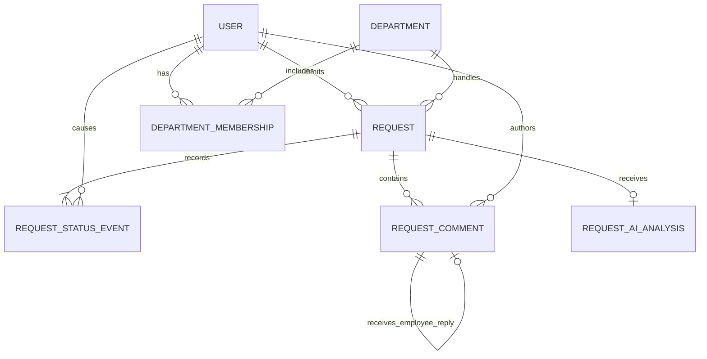

# Internal Operations Service Hub — Current Data Model

## Purpose

The PostgreSQL model supports authentication, department-based authorization,
request processing, status traceability, conversations, resolutions, and optional
AI assistance. Prisma defines the executable schema in `prisma/schema.prisma`.

## Persisted entities

### User

Represents a provisioned application user.

| Field | Purpose |
| --- | --- |
| `id` | Unique user identifier |
| `name` | Display name |
| `email` | Unique, normalized login email |
| `passwordHash` | Bcrypt password hash; plaintext is never stored |
| `isAdmin` | Grants application-wide request access |
| `createdAt` | Account creation time |

A user without department memberships is a regular employee. Memberships grant
department-staff access; `isAdmin` grants administrator access.

### Department

Represents an internal service department such as IT, HR, or Finance.

| Field | Purpose |
| --- | --- |
| `id` | Stable department identifier |
| `name` | Unique display name |
| `isActive` | Determines whether the department accepts new requests |

### DepartmentMembership

Joins a user to a department. Its composite primary key
`(userId, departmentId)` prevents duplicate membership. The backend uses this
relationship, rather than client-provided roles, to authorize staff actions.

### Request

Represents one employee service request.

| Field | Purpose |
| --- | --- |
| `id` | Unique request identifier |
| `requesterId` | User who submitted the request |
| `departmentId` | Responsible department selected at submission |
| `title`, `description` | Employee-provided request content |
| `currentStatus` | Current workflow state |
| `createdAt`, `updatedAt` | Audit timestamps |
| `resolvedAt` | Time of successful resolution |
| `resolutionNote` | Required final outcome when resolved |

`currentStatus` is stored for efficient queues while the complete change history is
preserved in `RequestStatusEvent`.

### RequestStatusEvent

Records every request status transition, including the initial `SUBMITTED` event,
the previous and next state, the user who caused it, and the creation time.

### RequestComment

Stores staff messages and targeted employee replies. Each comment belongs to one
request and one author. A nullable, unique `replyToCommentId` self-reference links
an employee reply to exactly one staff message and limits that message to one
employee reply. Authorization is evaluated through the parent request before a
comment is read or created. New messages are accepted only while the parent request
is `IN_PROGRESS`; submitted requests are waiting for staff ownership and resolved
conversations are read-only.

### RequestAiAnalysis

Stores one optional AI analysis per request.

| Field group | Purpose |
| --- | --- |
| Status | `PENDING`, `COMPLETED`, or `FAILED` |
| Interpretation | Request type, concise summary, urgency, clarification state |
| Routing | Suggested active department, without changing the real department |
| Guidance | Validated model-generated next steps; the legacy context-key array remains empty |
| Reproducibility | Provider, model, and prompt version |
| Failure handling | Normalized failure code and completion time |

The table stores validated application fields, not chain-of-thought, full provider
responses, secrets, or employee credentials.

## Relationships



## Request lifecycle

```text
SUBMITTED -> IN_PROGRESS -> RESOLVED
```

States cannot be skipped or moved backward. Every successful transition updates
`Request.currentStatus` and creates `RequestStatusEvent` in one transaction.

## Core invariants

1. Every request has exactly one requester and one responsible department.
2. Every request begins in `SUBMITTED` and has an initial status event.
3. Only requester, responsible department staff, or administrators may view a
   request or participate in its conversation.
4. Only responsible department staff or administrators may update status.
5. A transition succeeds only when `expectedCurrentStatus` still matches storage.
6. `RESOLVED` requires a non-empty resolution note and sets `resolvedAt`.
7. Comments are optional and never gate status transitions.
8. Only staff or administrators initiate top-level messages, and only during `IN_PROGRESS`.
9. A requester reply must target a staff message on the same request.
10. A requester may answer only the latest staff message, with at most one reply.
11. `SUBMITTED` and `RESOLVED` requests reject new comments.
12. An AI suggestion never changes authoritative request fields.
13. A request remains valid when AI is disabled or its analysis fails.
14. Suggested departments must be active values supplied by the backend, and
    `trustedContextKeys` remains empty because no company knowledge source is connected.

## Referential behavior

- Deleting a request cascades to its comments, status events, and AI analysis.
- Deleting a user with authored or status-history records is restricted.
- Deleting a department referenced by requests is restricted.
- Deleting a user or department cascades its membership rows.

These rules preserve business history while allowing relationship cleanup where it
does not erase request evidence.

## Indexes and access patterns

| Index or constraint | Supported operation |
| --- | --- |
| Unique `User.email` | Login and duplicate-account prevention |
| Primary `(userId, departmentId)` | Staff authorization and duplicate-membership prevention |
| `Request(requesterId, createdAt)` | Employee request history |
| `Request(departmentId, currentStatus, createdAt)` | Department work queue |
| `RequestStatusEvent(requestId, createdAt)` | Ordered status history |
| `RequestComment(requestId, createdAt)` | Ordered conversation |
| Unique `RequestAiAnalysis.requestId` | At most one current analysis per request |

## Deliberately absent from the current schema

The current implementation does not persist notifications, external identity
provider records, attachments, SLA targets, or automatic reassignment. These may
exist in the broader product vision but are not presented as delivered database
features.

## Related documents

- [Architecture](architecture.md)
- [Product specification](product-spec.md)
- [Status-history decision](decisions/ADR-001.md)
- [Detailed AI persistence design](delivery/week4-ai-assisted-requests.md)
