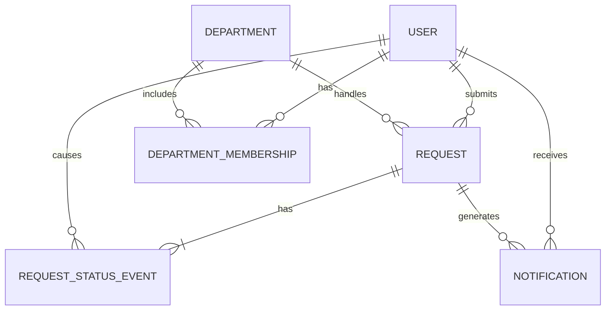

# Data Model — Internal Operations Service Hub

## 1. Purpose

This document defines the data model for the Internal Operations Service Hub.

The model supports employees submitting and tracking requests, department staff handling requests, administrators managing system access and departments, and notifications for important request events.

---

## 2. Domain Model

The core entities are:

1. `User`
2. `Department`
3. `DepartmentMembership`
4. `Request`
5. `RequestStatusEvent`
6. `Notification`

### 2.1 User

A `User` represents a company employee who uses the system.

Every user may act as a requester.

A user may also act as service department staff if they have a department membership.

A user may act as an administrator if they have administrator access.

| Field      | Purpose                                                   |
| ---------- | --------------------------------------------------------- |
| `id`       | Unique user identifier                                    |
| `name`     | Employee name                                             |
| `email`    | Employee email                                            |
| `is_admin` | Indicates whether the user has administrator-level access |

The access model intentionally does not use one general role field.

A user's responsibilities are determined by relationships:

* requester access comes from being the requester of a request;
* department staff access comes from `DepartmentMembership`;
* administrator access comes from `is_admin`.

---

### 2.2 Department

A `Department` represents a service department such as IT, HR, or Finance.

| Field       | Purpose                      |
| ------      | ---------------------------- |
| `id`        | Unique department identifier |
| `name`      | Department name              |
| `is_active` |Indicating whether the department is active and can receive new requests|             |

Administrators may create or manage departments.
Departments referenced by existing requests must not be permanently deleted. Instead, a department may be marked inactive. Inactive departments cannot receive new requests, but existing requests retain their department reference.

---

### 2.3 DepartmentMembership

`DepartmentMembership` represents the relationship between a user and a service department.

It is used to determine which users are authorized to handle requests for a department.

| Field           | Purpose                   |
| --------------- | ------------------------- |
| `user_id`       | References the staff user |
| `department_id` | References the department |

A department membership grants department-level access. It does not grant administrator access.

---

### 2.4 Request

A `Request` represents one employee request for help.

| Field            | Purpose                                           |
| ---------------- | ------------------------------------------------- |
| `id`             | Unique request identifier                         |
| `requester_id`   | References the employee who submitted the request |
| `department_id`  | References the responsible department             |
| `title`          | Short description of the request                  |
| `description`    | Details of the help needed                        |
| `current_status` | Current lifecycle state                           |
| `created_at`     | Time the request was submitted                    |
| `updated_at`     | Time the request was last updated                 |
| `resolved_at`    | Time the request was resolved, if applicable      |

---

### 2.5 RequestStatusEvent

`RequestStatusEvent` stores the history of request status changes.

| Field                | Purpose                        |
| -------------------- | ------------------------------ |
| `id`                 | Unique event identifier        |
| `request_id`         | References the related request |
| `from_status`        | Previous request status        |
| `to_status`          | New request status             |
| `changed_by_user_id` | User who caused the change     |
| `created_at`         | Time of the status change      |

The first status event records the creation of the request:

```text
NULL -> SUBMITTED
```

Later events record transitions such as:

```text
SUBMITTED -> IN_PROGRESS
IN_PROGRESS -> RESOLVED
```

---

### 2.6 Notification

A `Notification` represents a notification generated because of an important request event.

Examples include:

* notifying department staff when a new request requires their attention;
* notifying the requester when the request status changes;
* notifying the requester when the request is resolved.

| Field               | Purpose                                                      |
| ------------------- | ------------------------------------------------------------ |
| `id`                | Unique notification identifier                               |
| `recipient_user_id` | References the user who should receive the notification      |
| `request_id`        | References the request that caused the notification          |
| `event_type`        | Identifies the event that caused the notification            |
| `delivery_status`   | Indicates whether delivery is pending, successful, or failed |
| `created_at`        | Time the notification was created                            |
| `delivered_at`      | Time delivery succeeded, if applicable                       |

Possible notification event types include:

```text
NEW_REQUEST
STATUS_CHANGED
REQUEST_RESOLVED
```

Possible delivery states include:

```text
PENDING
DELIVERED
FAILED
```

One logical notification is stored for each intended recipient.

The exact delivery channel, such as email or in-app notification, is intentionally not defined because that decision remains open in the product specification.

---

## 3. Relationships and Cardinality

| Relationship                        | Cardinality                                                                          |
| ----------------------------------- | ------------------------------------------------------------------------------------ |
| User submits Request                | One user can submit many requests; each request has one requester                    |
| Department handles Request          | One department can handle many requests; each request has one responsible department |
| User has DepartmentMembership       | One user can have zero or more department memberships                                |
| Department has DepartmentMembership | One department can have zero or more staff memberships                               |
| Request has RequestStatusEvent      | One request has one or more status events                                            |
| User causes RequestStatusEvent      | One user can cause many status events                                                |
| User receives Notification          | One user can receive zero or many notifications                                      |
| Request generates Notification      | One request can generate zero or many notifications                                  |

### Relationship Diagram

The following diagram summarizes how the main records are connected.

`||` means exactly one, `o{` means zero or many, and `|{` means one or many.



Administrator access is represented by `User.is_admin` and therefore does not require a separate relationship.

---

## 4. Request Lifecycle

The request lifecycle is:

```text
SUBMITTED
    |
    v
IN_PROGRESS
    |
    v
RESOLVED
```

### States

* `SUBMITTED` — the request has been created and is waiting to be handled.
* `IN_PROGRESS` — the responsible department is actively handling the request.
* `RESOLVED` — the work is complete.

### Allowed Transitions

| From          | To            |
| ------------- | ------------- |
| `SUBMITTED`   | `IN_PROGRESS` |
| `IN_PROGRESS` | `RESOLVED`    |

A newly created request begins in `SUBMITTED`.

Every successful status transition creates a `RequestStatusEvent`.

Important status changes may also create notifications for the appropriate users.

---

## 5. Invariants and Authorization Rules

The following rules must always remain true:

1. Every request has exactly one requester.
2. Every request has exactly one responsible department.
3. Every request has exactly one valid current status.
4. Every request has at least one status event.
5. The latest status event must match `Request.current_status`.
6. Status changes must follow the allowed lifecycle.
7. status update must only succeed if the request is still in the expected current status when the update is applied.
8. `resolved_at` is set only when the request is `RESOLVED`.
9. A requester can view their own submitted requests.
10. Department staff can view and update requests only for departments in which they have membership.
11. Authorization is determined from stored system relationships, not from client-provided values alone.
12. Administrative actions may only be performed by a user with administrator access.
13. Department membership does not automatically grant administrator access.
14. Every notification has exactly one intended recipient.
15. Every notification is associated with the request that caused it.
16. A user must only receive notification information they are authorized to receive.
17. A notification is created only after the related request operation or status change has been successfully stored.
18. Failure to deliver a notification must not undo a successfully stored request or status change.

---

## 6. Storage

### 6.1 What Must Persist

The system must durably store:

* users;
* administrator access information;
* departments;
* department memberships;
* requests;
* current request status;
* request status history;
* notifications and their delivery state.

These records are necessary for the product to continue working correctly after application restarts.

---

### 6.2 Storage Model

Version 0.3 uses PostgreSQL through Prisma. A relational model is appropriate because the product has clear and stable relationships:

* requests belong to users;
* requests belong to departments;
* department staff authorization depends on membership;
* status events belong to requests;
* notifications belong to recipients and requests;
* administrator access belongs to users.

Relational storage also supports consistency between a request's current status and its status history.

When a status changes, the system should update:

```text
Request.current_status
```

and create:

```text
RequestStatusEvent
```

as one consistent operation.

After that operation succeeds, any required notification may be created.

This keeps notification delivery separate from the consistency of the request itself.

---

### 6.3 Durable vs. Derived Data

#### Durable

Stored directly:

* user records;
* administrator access;
* departments;
* department memberships;
* requests;
* current status;
* status events;
* notifications;
* notification delivery status.

#### Derived

Calculated when needed:

* number of requests submitted by a user;
* number of requests in a department;
* number of open or resolved requests;
* request age;
* time from submission to resolution;
* whether a user is department staff for a specific request, based on membership.

`Request.current_status` could be derived from the latest status event, but it is stored directly because current status is needed frequently.

---

## 7. Access Patterns

The data model supports the main product queries.

### 7.1 Employee Views Their Requests

Find requests where:

```text
requester_id = current_user.id
```

Typical ordering:

```text
created_at DESC
```

Justified index:

```text
Request(requester_id, created_at)
```

---

### 7.2 Department Staff View Department Requests

Find requests where:

```text
department_id = staff_department_id
```

Department membership is checked before access is allowed.

Justified index:

```text
Request(department_id, current_status, created_at)
```

This supports department queues and filtering by status.

---

### 7.3 View Request Status History

Find status events where:

```text
request_id = selected_request.id
```

ordered by:

```text
created_at
```

Justified index:

```text
RequestStatusEvent(request_id, created_at)
```

---

### 7.4 Determine Department Staff Authorization

Check whether a membership exists where:

```text
user_id = current_user.id
department_id = request.department_id
```

A useful uniqueness constraint is:

```text
DepartmentMembership(user_id, department_id)
```

This prevents the same user from having duplicate memberships in the same department.

---

### 7.5 Administrator Access

Before an administrative operation, verify:

```text
current_user.is_admin = true
```

Administrators may then perform permitted operations such as:

* managing departments;
* managing department memberships;
* managing administrator access.

Normal users cannot perform these operations unless they have administrator access.

---

### 7.6 Retrieve User Notifications

Find notifications where:

```text
recipient_user_id = current_user.id
```

Typical ordering:

```text
created_at DESC
```

Justified index:

```text
Notification(recipient_user_id, created_at)
```

A user must not retrieve another user's notifications unless specifically authorized.

---

### 7.7 Notify Department Staff About a New Request

When a new request is successfully stored:

1. Find department memberships where:

```text
department_id = request.department_id
```

2. Identify the associated staff users.

3. Create the required notification for each intended recipient.

This allows the system to notify the appropriate department staff without storing a duplicate list of department users on the request itself.

---

## 8. Requirements Traceability

| Requirement / Product Behavior                | Data Model Support                                              |
| --------------------------------------------- | --------------------------------------------------------------- |
| Submit a request                              | `Request`                                                       |
| Associate request with responsible department | `Request.department_id -> Department.id`                        |
| View submitted requests                       | `Request.requester_id`                                          |
| Track current request status                  | `Request.current_status`                                        |
| Track request history                         | `RequestStatusEvent`                                            |
| Department staff view department requests     | `DepartmentMembership` + `Request.department_id`                |
| View request details                          | `Request` + authorization relationships                         |
| Department staff update request status        | Lifecycle rules + `DepartmentMembership` + `RequestStatusEvent` |
| Recognize completed work                      | `RESOLVED` status + `resolved_at`                               |
| Notify responsible department                 | `DepartmentMembership` + `Notification`                         |
| Notify requester of important changes         | `Request.requester_id` + `Notification`                         |
| Administrator manages departments             | `User.is_admin` + `Department`                                  |
| Administrator manages access                  | `User.is_admin` + `DepartmentMembership` + administrator access |
| Protect notification recipients               | `Notification.recipient_user_id` + authorization rules          |
